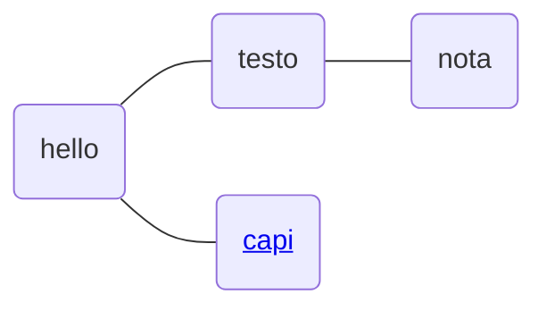

# Prova con diagramma
## Mermaid

<mark>amici</mark>

[included Markdown from URL](https://raw.githubusercontent.com/paulhibbitts/markdown-file-examples/main/itworks.md ":include")

Offerte

[nota2](/%2F/nota2.md)
<!--stackedit_data:
eyJoaXN0b3J5IjpbNzQ4NDMzNDY5XX0=
-->
